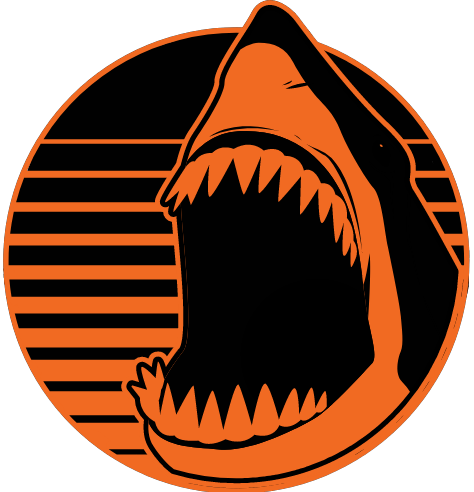

  

<h1 align="left">Hi
  , I'm Randy
</h1>

I write about things I am familiar with, things that I face at work, and things that I am learning. You will find them on my personal website [randymorales.dev](https://randymorales.dev) 📝.

🔭 I’m currently working at [Aruba Networks](https://www.arubanetworks.com/products/switches/)

🌱 I’m currently learning **JavaScript, Advanced Go, Software Architecture, Italian**

💡 I’m looking to collaborate on **open source projects**

⚡ Fun fact: I like videogames 🎮, cycling 🚴, being active ⚽️, read 📖

 

<h3 align="left">📕 Latest Blog Posts</h3>

<!-- BLOG-POST-LIST:START -->
- [Show Page Views in Next.js with Google Analytics](https://randymorales.dev/blog/show-page-views-with-google-analytics-nextjs)
- [Adding Code Highlighting to a NextJS Blog with Prism](https://randymorales.dev/blog/adding-code-highlighting-to-nextjs)
- [Adding Comments to a NextJS Blog](https://randymorales.dev/blog/adding-comments-to-my-blog)
<!-- BLOG-POST-LIST:END -->

 

<h3 align="left">🗣 Connect with me</h3>
 

